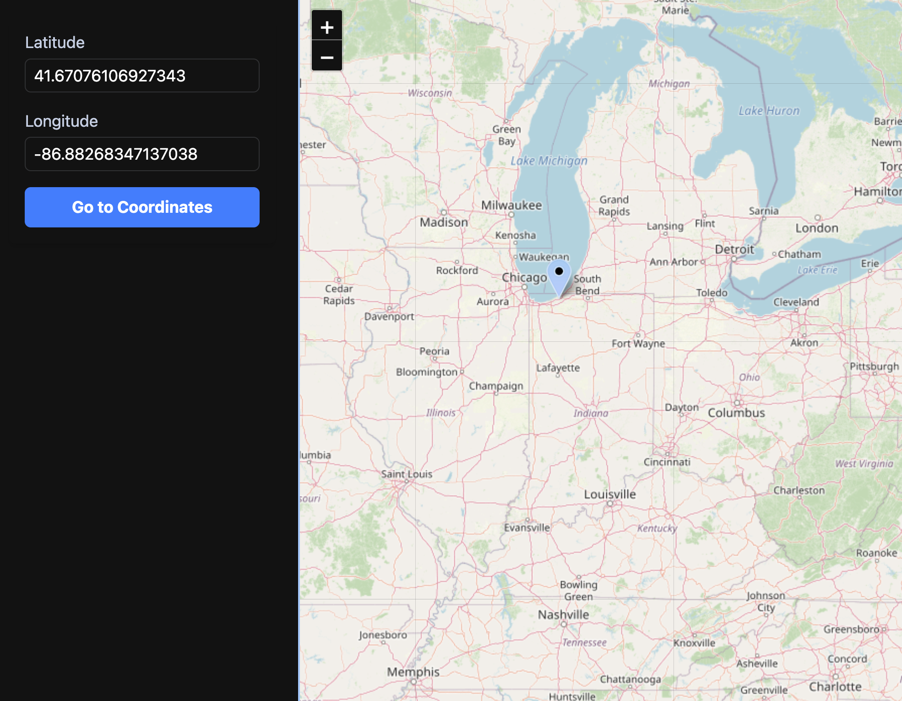

# Map Coordinate Viewer

## Overview

Map Coordinate Viewer is a simple web application that allows users to input geographic coordinates (latitude and longitude) and visualize the corresponding location on an interactive map. This tool is useful for quickly checking coordinates, sharing locations, or integrating into mapping workflows.

## Features

- Input latitude and longitude to view the location on a map
- Interactive map display
- Responsive and user-friendly interface

## Preview



## Getting Started

### Prerequisites

- [Node.js](https://nodejs.org/) (v16 or higher recommended)
- [npm](https://www.npmjs.com/) or [yarn](https://yarnpkg.com/)

### Installation

1. Clone the repository:

  ```bash
  git clone https://github.com/hectorsvill/Map-Coordinate-Viewer.git
  cd Map-Coordinate-Viewer
  ```

2. Install dependencies:

```bash
npm install
  
```

### Running the App

To start the development server:

```bash
npm run dev

```

The app will be available at `http://localhost:5173` (or as indicated in your terminal).

### Building for Production

To build the app for production:

```bash
npm run build

```

The output will be in the `dist/` directory.

## Initial Setup

```bash
# create app
npm create vite@latest map-coordinate-viewer -- --template react-ts

# install dependencies
npm install -D tailwindcss postcss autoprefixer
npm install leaflet
npm install -D @types/leaflet

# Tailwindcss integration
npm install tailwindcss @tailwindcss/vite

npm install react-leaflet
```
